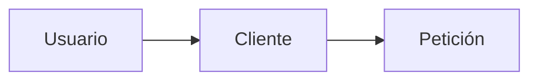
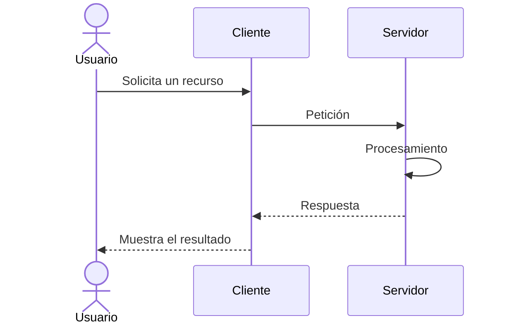
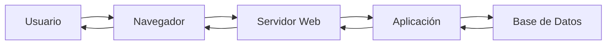
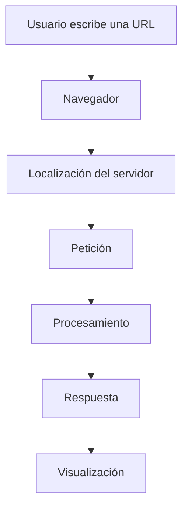
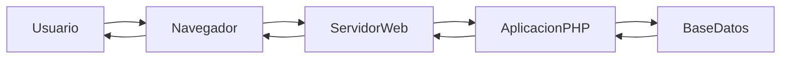
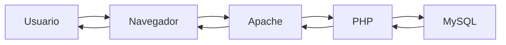

# Relación Cliente-Servidor

## Introducción

La arquitectura cliente-servidor constituye uno de los pilares fundamentales sobre los que se construye Internet.

Cada vez que consultamos una página web, reproducimos un vídeo, realizamos una compra online o utilizamos una red social, se produce una comunicación entre un cliente que realiza una solicitud y un servidor que responde a ella.

Comprender este modelo es esencial para cualquier desarrollador web.

---

## ¿Qué es un cliente?

Un cliente es una aplicación capaz de solicitar información o servicios a otro sistema.

En el ámbito del desarrollo web, el cliente suele ser un navegador web.

- Google Chrome
- Mozilla Firefox
- Microsoft Edge
- Safari

---

## ¿Qué es un servidor?

Un servidor es un sistema capaz de recibir solicitudes, procesarlas y generar respuestas.

Puede proporcionar páginas web, imágenes, vídeos, archivos descargables, bases de datos y aplicaciones completas.

---

## Relación entre cliente y servidor

1. El cliente solicita información.
2. El servidor recibe la solicitud.
3. Procesa la petición.
4. Genera una respuesta.
5. Devuelve el resultado al cliente.

---

## Un ejemplo cotidiano

| Arquitectura web | Restaurante |
|------------------|------------|
| Cliente | Cliente |
| Servidor | Camarero |
| Petición | Pedido |
| Respuesta | Comida servida |

---

## Arquitectura básica de una aplicación web

### Usuario
Persona que utiliza la aplicación.

### Navegador
Programa encargado de realizar solicitudes y mostrar resultados.

### Servidor Web
Software que recibe peticiones y envía respuestas.

### Aplicación
Código desarrollado por los programadores.

### Base de Datos
Sistema encargado de almacenar la información.

---

## El ciclo de una petición web

Cuando escribimos una dirección web, el navegador debe localizar el servidor, enviar una petición y mostrar la respuesta.

---

## Componentes que intervienen en una petición

---

## Cliente ligero y cliente pesado

### Cliente ligero

La mayor parte del procesamiento se realiza en el servidor.

### Cliente pesado

Parte importante del procesamiento se realiza en el navegador.

---

## Ventajas de la arquitectura cliente-servidor

- Centralización.
- Seguridad.
- Escalabilidad.
- Mantenimiento.
- Compartición de recursos.

---

## Ejemplos reales

### Gmail
- Cliente: navegador.
- Servidor: Google.

### Netflix
- Cliente: aplicación o navegador.
- Servidor: plataforma de streaming.

### Moodle
- Cliente: navegador.
- Servidor: plataforma educativa.

### Amazon
- Cliente: navegador o app.
- Servidor: infraestructura de comercio electrónico.

---

## El modelo cliente-servidor en DWES

---

## Actividades de reflexión

### Actividad 1
Explica con tus palabras qué ocurre desde que escribes una URL hasta que aparece la página.

### Actividad 2
Identifica cliente y servidor en Netflix, Gmail, Amazon y Moodle.

### Actividad 3
Busca tres servicios web que utilices habitualmente e identifica sus elementos.

---

## Autoevaluación

1. ¿Qué es un cliente?
2. ¿Qué es un servidor?
3. ¿Cuál es la función del navegador?
4. ¿Qué es una petición?
5. ¿Qué es una respuesta?
6. ¿Qué elementos forman una aplicación web?
7. ¿Qué ventajas ofrece la arquitectura cliente-servidor?
8. ¿Qué ocurre cuando escribimos una URL?
9. ¿Qué diferencia existe entre cliente ligero y pesado?
10. ¿Qué papel tendrá PHP en esta arquitectura?

---

## Resumen

!!! success "Ideas clave"

    - Internet se basa en la arquitectura cliente-servidor.
    - El cliente solicita recursos y el servidor genera respuestas.
    - PHP se ejecutará en el servidor.
    - Comprender esta arquitectura es fundamental para el resto del módulo.
