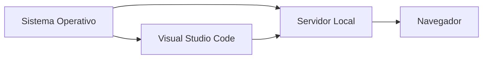

# Introducción

## Bienvenido al módulo DWES

El módulo de **Desarrollo Web en Entorno Servidor (DWES)** tiene como objetivo aprender a desarrollar aplicaciones web dinámicas capaces de responder a las peticiones realizadas por los usuarios a través de Internet.

Hoy en día utilizamos constantemente aplicaciones web como plataformas de vídeo, redes sociales, tiendas online, aplicaciones bancarias o entornos educativos. Aunque el usuario únicamente ve una interfaz en su navegador, detrás de ella existe una infraestructura compuesta por servidores, bases de datos y aplicaciones que procesan la información y generan respuestas dinámicas.

Durante este curso aprenderás a desarrollar este tipo de aplicaciones utilizando herramientas y tecnologías ampliamente utilizadas en el entorno profesional.

---

## ¿Qué es una aplicación web?

Una aplicación web es un programa accesible a través de un navegador que permite a los usuarios interactuar con información almacenada y procesada en servidores.

Algunos ejemplos son:

- Gmail
- YouTube
- Netflix
- Amazon
- Moodle

La característica principal de estas aplicaciones es que generan contenido dinámicamente en función de las acciones realizadas por el usuario.

---

## Frontend y Backend

En cualquier aplicación web moderna podemos distinguir dos partes fundamentales.

### Frontend

Es la parte visible para el usuario.

Se encarga de:

- Mostrar información.
- Recoger datos del usuario.
- Gestionar la interacción.

Las tecnologías más habituales son:

- HTML
- CSS
- JavaScript

### Backend

Es la parte que se ejecuta en el servidor.

Se encarga de:

- Procesar peticiones.
- Validar información.
- Gestionar usuarios.
- Acceder a bases de datos.
- Generar respuestas dinámicas.

Este módulo se centra principalmente en esta segunda parte.

---

## Tecnologías que estudiaremos

A lo largo del curso trabajaremos con diferentes herramientas y tecnologías:

### PHP

Lenguaje de programación especializado en el desarrollo web del lado servidor.

### MySQL

Sistema gestor de bases de datos utilizado para almacenar la información de nuestras aplicaciones.

### Git y GitHub

Herramientas para el control de versiones y trabajo colaborativo.

### Symfony

Framework profesional utilizado para desarrollar aplicaciones web complejas mediante arquitectura MVC.

---

## El entorno de trabajo

Antes de escribir nuestro primer programa es necesario preparar correctamente el entorno de desarrollo.

Para ello necesitaremos:

- Un sistema operativo.
- Un servidor local.
- Un entorno de desarrollo (IDE).
- Un navegador web.

Todos estos elementos se estudiarán y configurarán durante esta unidad.

## Objetivos de la unidad

Al finalizar esta unidad deberás ser capaz de:

✅ Comprender qué es el desarrollo web en entorno servidor.

✅ Diferenciar entre frontend y backend.

✅ Identificar las herramientas necesarias para desarrollar aplicaciones web.

✅ Comprender la importancia de un entorno de trabajo correctamente configurado.

✅ Preparar tu equipo para comenzar a programar en PHP.

---

## ¿Por qué es importante esta unidad?

!!! info "La base del módulo"
Todas las unidades posteriores dependerán de los conceptos y herramientas estudiados aquí.
Por ello es importante comprender cómo funciona una aplicación web y disponer de un entorno
correctamente configurado antes de empezar a programar.

---

Las próximas unidades se centrarán en:

- PHP.
- Formularios.
- Programación orientada a objetos.
- Bases de datos.
- Symfony.
- APIs y servicios web.
