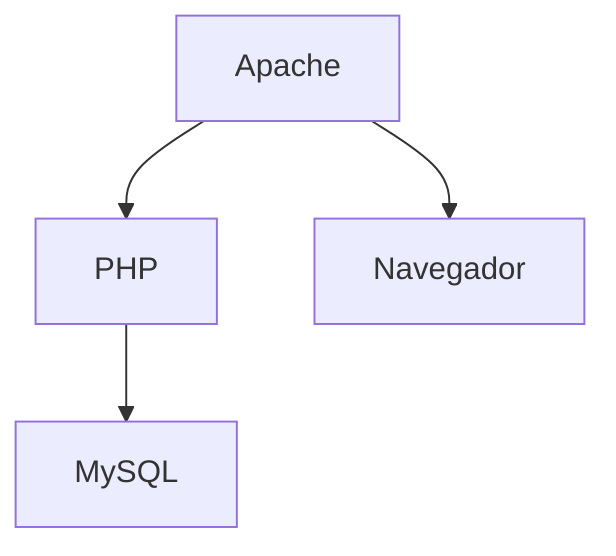
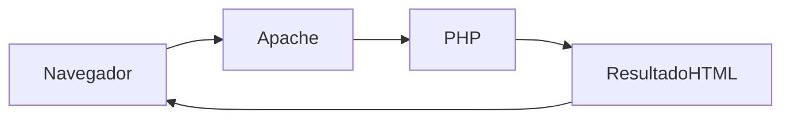
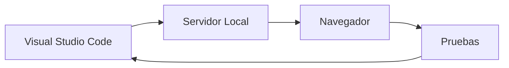

# Servidor Local

## Introducción

Antes de comenzar a desarrollar aplicaciones web es necesario disponer de un entorno que permita ejecutar nuestro código.

Cuando visitamos una página web en Internet, las aplicaciones se ejecutan en servidores remotos. Sin embargo, durante el proceso de aprendizaje y desarrollo resulta mucho más cómodo disponer de un servidor instalado en nuestro propio ordenador.

A este entorno lo denominamos **servidor local**.

Gracias a él podremos desarrollar, probar y corregir aplicaciones web sin necesidad de subirlas a Internet.

---

## ¿Qué es un servidor local?

Un servidor local es un conjunto de herramientas instaladas en nuestro ordenador que permiten simular el funcionamiento de un servidor web real.

Su objetivo es proporcionar un entorno donde podamos:

- Ejecutar aplicaciones web.
- Realizar pruebas.
- Detectar errores.
- Gestionar bases de datos.
- Desarrollar proyectos de forma segura.

---

## ¿Por qué necesitamos un servidor local?

Cuando trabajemos con PHP descubriremos que nuestro código no puede ejecutarse directamente desde el navegador.

Será necesario que exista un servidor capaz de interpretar nuestras instrucciones y generar una respuesta.

Un servidor local nos permite:

✅ Trabajar sin conexión a Internet.

✅ Realizar pruebas de forma segura.

✅ Detectar errores antes de publicar una aplicación.

✅ Utilizar las mismas tecnologías que encontraremos en servidores reales.

---

## Componentes principales

Un servidor local suele estar formado por varios componentes que trabajan conjuntamente.

---

## Apache

### ¿Qué es Apache?

Apache es uno de los servidores web más utilizados del mundo.

Su función consiste en:

- Recibir peticiones de los navegadores.
- Procesar solicitudes.
- Enviar respuestas.

---

## PHP

PHP es el lenguaje de programación que utilizaremos durante este módulo.

Sus funciones principales serán:

- Procesar formularios.
- Generar contenido dinámico.
- Gestionar usuarios.
- Acceder a bases de datos.

---

## MySQL

Las aplicaciones modernas necesitan almacenar información.

Por ejemplo:

- Usuarios.
- Contraseñas.
- Productos.
- Pedidos.
- Mensajes.

MySQL es uno de los sistemas gestores de bases de datos más utilizados en aplicaciones web.

---

## phpMyAdmin

phpMyAdmin es una herramienta gráfica que facilita la administración de bases de datos MySQL.

Permite:

- Crear bases de datos.
- Crear tablas.
- Insertar registros.
- Ejecutar consultas.
- Gestionar usuarios.

---

## WAMP

WAMP significa:

- Windows
- Apache
- MySQL
- PHP

### Ventajas

- Instalación sencilla.
- Configuración integrada.
- Ideal para principiantes.

---

## XAMPP

XAMPP es una distribución multiplataforma.

Puede instalarse en:

- Windows.
- Linux.
- macOS.

### Ventajas

- Multiplataforma.
- Fácil instalación.
- Amplia documentación.

---

## Comparativa WAMP y XAMPP

| Característica | WAMP | XAMPP |
|---------------|------|--------|
| Windows | ✅ | ✅ |
| Linux | ❌ | ✅ |
| macOS | ❌ | ✅ |
| Multiplataforma | ❌ | ✅ |

---

## Flujo de trabajo de un desarrollador web

1. Escribimos código en Visual Studio Code.
2. Guardamos los archivos.
3. El servidor local procesa la aplicación.
4. El navegador muestra el resultado.
5. Revisamos el funcionamiento.
6. Corregimos errores.

---

## Actividad evaluable

### Instalación del servidor local

Las distribuciones más utilizadas son WAMP y XAMPP.

### Tareas

1. Instala WAMP o XAMPP en tu ordenador.
2. Comprueba que los servicios funcionan correctamente.
3. Realiza una captura de pantalla del panel de control.
4. Entrega la captura.

---

## Actividades de reflexión

### Actividad 1

Investiga las diferencias entre instalar Apache, PHP y MySQL por separado o mediante XAMPP.

### Actividad 2

Explica la función de Apache, PHP, MySQL y phpMyAdmin.

---

## Autoevaluación

1. ¿Qué es un servidor local?
2. ¿Para qué sirve Apache?
3. ¿Qué papel tiene PHP?
4. ¿Para qué sirve MySQL?
5. ¿Qué es phpMyAdmin?
6. ¿Qué significa WAMP?
7. ¿Qué significa XAMPP?

---

## Resumen

!!! success "Ideas clave"

    - Un servidor local permite desarrollar y probar aplicaciones web.
    - Apache, PHP y MySQL son componentes fundamentales.
    - WAMP y XAMPP facilitan la instalación.
    - Utilizaremos este entorno para ejecutar nuestras aplicaciones PHP.
