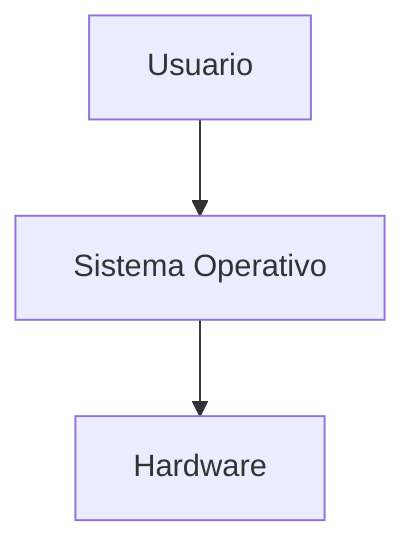
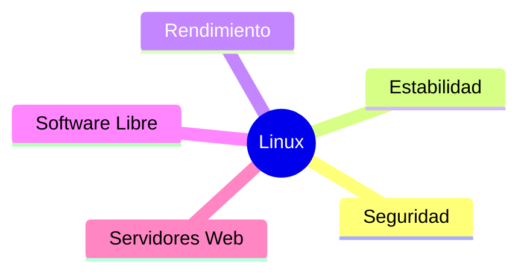

# Sistemas Operativos

## Introducción

Todo desarrollador necesita un sistema operativo sobre el que ejecutar sus herramientas de trabajo. Un sistema operativo es el software encargado de gestionar los recursos del ordenador y permitir la comunicación entre el hardware, las aplicaciones y el usuario.

Sin un sistema operativo no podríamos ejecutar programas, acceder a archivos, utilizar dispositivos o conectarnos a Internet.

---

## ¿Qué es un sistema operativo?

Un sistema operativo (SO) es el conjunto de programas que controla el funcionamiento básico de un ordenador.

Actúa como intermediario entre:

- El hardware.
- Las aplicaciones.
- El usuario.

---

## Funciones principales

### Gestión de procesos

Permite ejecutar varios programas al mismo tiempo y administra los recursos que necesita cada uno.

### Gestión de memoria

Controla la utilización de la memoria RAM para que las aplicaciones funcionen correctamente.

### Gestión de archivos

Organiza la información almacenada en discos, carpetas y archivos.

### Gestión de dispositivos

Controla periféricos como:

- Teclados.
- Ratones.
- Impresoras.
- Tarjetas gráficas.
- Tarjetas de red.

### Seguridad

Gestiona usuarios, permisos y controles de acceso.

---

## Principales sistemas operativos

### Windows

Windows es el sistema operativo de escritorio más utilizado del mundo.

#### Ventajas

- Fácil de utilizar.
- Gran compatibilidad con software comercial.
- Amplio soporte de fabricantes.

#### Inconvenientes

- Requiere licencia.
- Menor flexibilidad para tareas avanzadas.
- Mayor consumo de recursos.

---

### Linux

Linux es un sistema operativo libre y de código abierto.

Es especialmente popular en servidores, centros de datos y entornos de desarrollo.

#### Ventajas

- Gratuito.
- Seguro.
- Estable.
- Altamente configurable.
- Excelente rendimiento.

#### Inconvenientes

- Curva de aprendizaje inicial superior.
- Algunas aplicaciones comerciales no están disponibles de forma nativa.

---
!!! tip "Dato importante"
La inmensa mayoría de servidores web de Internet utilizan alguna distribución Linux.

---

### macOS

macOS es el sistema operativo desarrollado por Apple para sus ordenadores.

#### Ventajas

- Gran estabilidad.
- Excelente integración con el hardware.
- Buen entorno para desarrollo.

#### Inconvenientes

- Requiere hardware específico de Apple.
- Menor capacidad de personalización.

---

## Comparativa general

| Característica | Windows | Linux | macOS |
|---------------|----------|--------|--------|
| Licencia | Comercial | Libre | Comercial |
| Facilidad de uso | Alta | Media | Alta |
| Uso en servidores | Medio | Muy alto | Bajo |
| Personalización | Media | Muy alta | Baja |
| Coste | Licencia de pago | Gratuito | Incluido con el equipo |

---

## Distribuciones Linux

Linux se distribuye en diferentes versiones conocidas como distribuciones.

Algunas de las más conocidas son:

- Ubuntu
- Debian
- Fedora
- Linux Mint
- Arch Linux
- Rocky Linux

Todas comparten el núcleo Linux, pero presentan diferencias en herramientas, interfaz y filosofía de uso.

---

## Ubuntu como entorno de desarrollo

Durante este curso utilizaremos Ubuntu como sistema operativo principal en el aula.

Ubuntu es una de las distribuciones Linux más populares debido a:

- Facilidad de instalación.
- Gran comunidad de usuarios.
- Amplia documentación.
- Excelente compatibilidad con herramientas de programación.
- Uso frecuente en entornos educativos.

### Ventajas para el desarrollo web

Ubuntu facilita el trabajo con:

- PHP.
- Apache.
- MySQL.
- Git.
- Symfony.

Todas estas herramientas pueden instalarse y actualizarse fácilmente mediante gestores de paquetes.

---

## Linux en los servidores web

Cuando visitamos una página web, normalmente estamos accediendo a un servidor remoto.

La mayoría de estos servidores utilizan Linux debido a:

- Estabilidad.
- Seguridad.
- Rendimiento.
- Escalabilidad.
- Coste reducido.

Por este motivo resulta especialmente útil familiarizarse con este sistema operativo desde el inicio del módulo.

---

## Actividad de reflexión

### Actividad 1

Investiga qué sistema operativo utilizan habitualmente los proveedores de alojamiento web.

Responde:

1. ¿Qué sistema operativo utilizan?
2. ¿Qué ventajas ofrece frente a otros sistemas?
3. ¿Por qué crees que es el más utilizado?

---

## Actividad 2

Compara Windows y Ubuntu.

Elabora una tabla indicando:

- Ventajas.
- Inconvenientes.
- Casos de uso.

---

## Autoevaluación

1. ¿Qué es un sistema operativo?
2. ¿Cuáles son sus funciones principales?
3. ¿Qué ventajas ofrece Linux para servidores?
4. ¿Por qué utilizamos Ubuntu en el aula?
5. ¿Qué diferencia existe entre una distribución Linux y el núcleo Linux?
6. ¿Qué sistema operativo se utiliza habitualmente en servidores web?

---

## Resumen

!!! success "Ideas clave"
    - El sistema operativo gestiona los recursos del ordenador.
    - Windows, Linux y macOS son los sistemas operativos más utilizados.
    - Linux domina el sector de los servidores web.
    - Ubuntu será el sistema utilizado durante este módulo.
    - Conocer el entorno de trabajo es fundamental antes de comenzar a programar.
