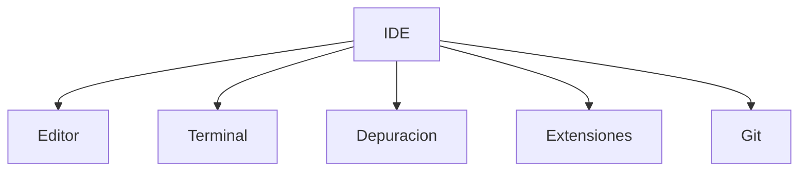
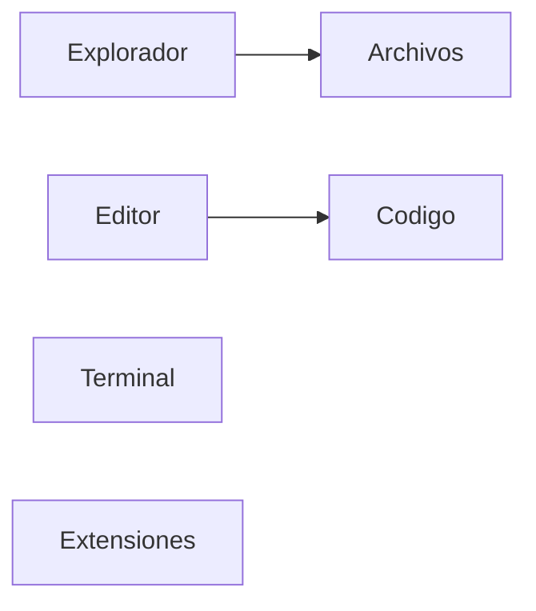
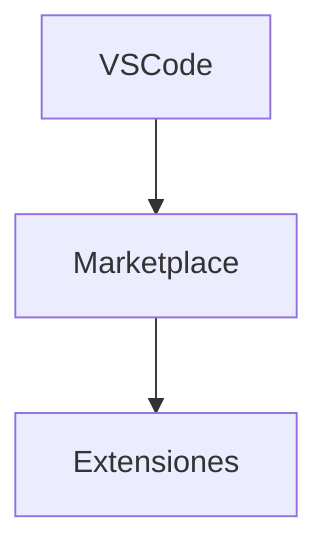

# Visual Studio Code

## Introducción

Para desarrollar aplicaciones de manera eficiente es necesario disponer de herramientas adecuadas.

Aunque podríamos escribir código utilizando un editor de texto simple, los entornos de desarrollo modernos ofrecen numerosas funcionalidades que facilitan enormemente el trabajo del programador.

Durante este módulo utilizaremos **Visual Studio Code**, una de las herramientas más utilizadas actualmente en el desarrollo web profesional.

---

## ¿Qué es Visual Studio Code?

Visual Studio Code (VS Code) es un editor de código desarrollado por Microsoft.

Se trata de una herramienta:

- Gratuita.
- Multiplataforma.
- Extensible mediante complementos.
- Compatible con múltiples lenguajes de programación.

---

## ¿Qué es un IDE?

IDE significa **Integrated Development Environment** (Entorno de Desarrollo Integrado).

Un IDE proporciona herramientas para facilitar el desarrollo de software.



---

## ¿Por qué utilizaremos Visual Studio Code?

### Fácil de utilizar

Su interfaz es intuitiva y sencilla.

### Multiplataforma

Puede utilizarse en Windows, Linux y macOS.

### Amplia comunidad

Cuenta con una enorme comunidad de usuarios.

### Miles de extensiones

Permite ampliar sus funcionalidades mediante complementos.

### Integración con Git

Facilita el control de versiones sin necesidad de cambiar de herramienta.

---

## Interfaz de Visual Studio Code



### Explorador

Permite visualizar la estructura del proyecto.

### Editor

Zona donde escribiremos nuestro código.

### Terminal

Permite ejecutar comandos directamente desde VS Code.

### Panel de extensiones

Facilita la instalación y gestión de complementos.

---

## Gestión de proyectos

Ejemplo de estructura:

```text
DWES/
├── docs/
├── mkdocs.yml
└── README.md
```

---

## Terminal integrada

Permite ejecutar comandos sin abandonar el entorno de desarrollo.

```bash
mkdocs serve
```

```bash
git status
```

```bash
php -v
```

---

## Extensiones

Las extensiones permiten ampliar las capacidades de VS Code.



### Extensiones recomendadas para DWES

#### Spanish Language Pack for Visual Studio Code

Traduce la interfaz al español.

#### PHP IntelliSense

Proporciona autocompletado y detección de errores.

#### Bracket Pair Color DLW

Facilita la lectura del código.

#### PHP Namespace Resolver

Ayuda a gestionar espacios de nombres.

#### PHP Class Creator

Genera clases automáticamente.

#### PHP Snippet Pack

Incluye fragmentos de código reutilizables.

#### PHP Getters & Setters

Genera métodos getter y setter automáticamente.

---

## Integración con Git


Permite visualizar cambios, crear commits y gestionar ramas.

---

## Buenas prácticas

- Organiza correctamente tus proyectos.
- Utiliza nombres descriptivos.
- Guarda frecuentemente.
- Mantén las extensiones actualizadas.
- Utiliza Git para controlar cambios.

---

## Actividad evaluable

### Instalación del IDE Visual Studio Code

1. Descarga Visual Studio Code para tu sistema operativo.
2. Instálalo siguiendo las instrucciones oficiales.
3. Instala las siguientes extensiones:

    - Spanish Language Pack for Visual Studio Code
    - PHP IntelliSense
    - Bracket Pair Color DLW
    - PHP Namespace Resolver
    - PHP Class Creator
    - PHP Snippet Pack
    - PHP Getters & Setters

4. Realiza una captura donde se visualicen el IDE y las extensiones instaladas.

### Evidencia

✅ Captura de pantalla del IDE correctamente configurado.

---

## Actividades de reflexión

### Actividad 1

Investiga otros entornos de desarrollo para PHP y compáralos con Visual Studio Code.

### Actividad 2

Explica qué ventajas aporta utilizar extensiones.

---

## Autoevaluación

1. ¿Qué es Visual Studio Code?
2. ¿Qué significa IDE?
3. ¿Qué ventajas ofrece VS Code?
4. ¿Para qué sirve la terminal integrada?
5. ¿Qué extensión proporciona autocompletado para PHP?
6. ¿Qué función tiene Git?
7. ¿Por qué es importante organizar correctamente un proyecto?

---

## Resumen

!!! success "Ideas clave"

    - Visual Studio Code será el entorno de desarrollo utilizado durante el curso.
    - Las extensiones amplían sus funcionalidades.
    - La terminal integrada facilita el trabajo diario.
    - Git permite gestionar versiones del proyecto.
