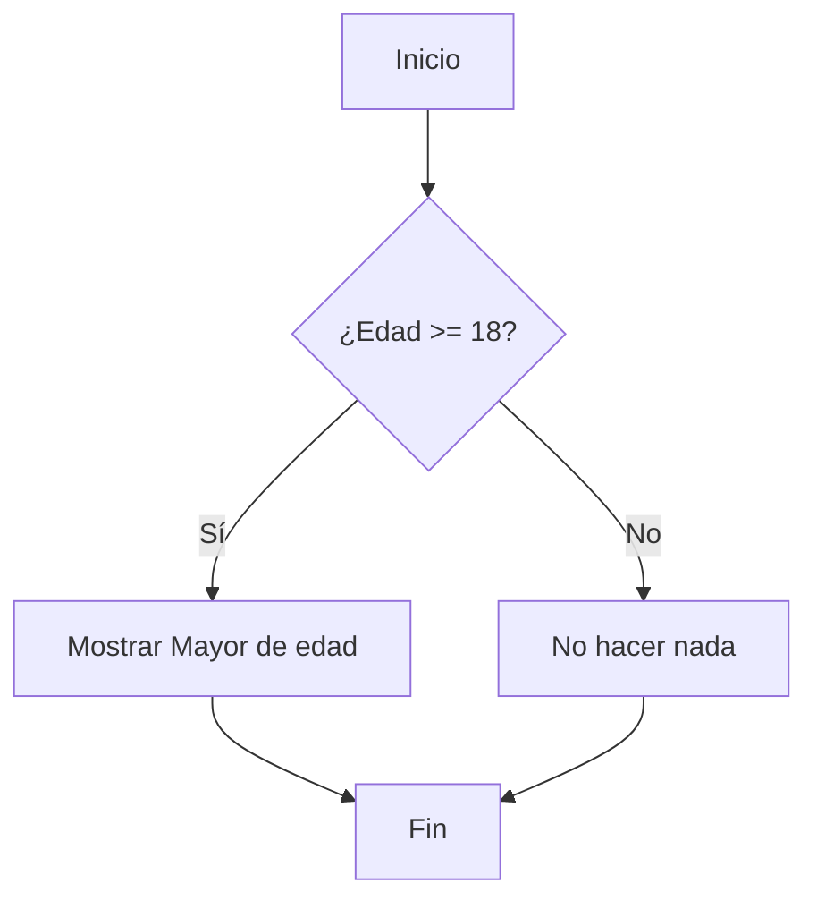
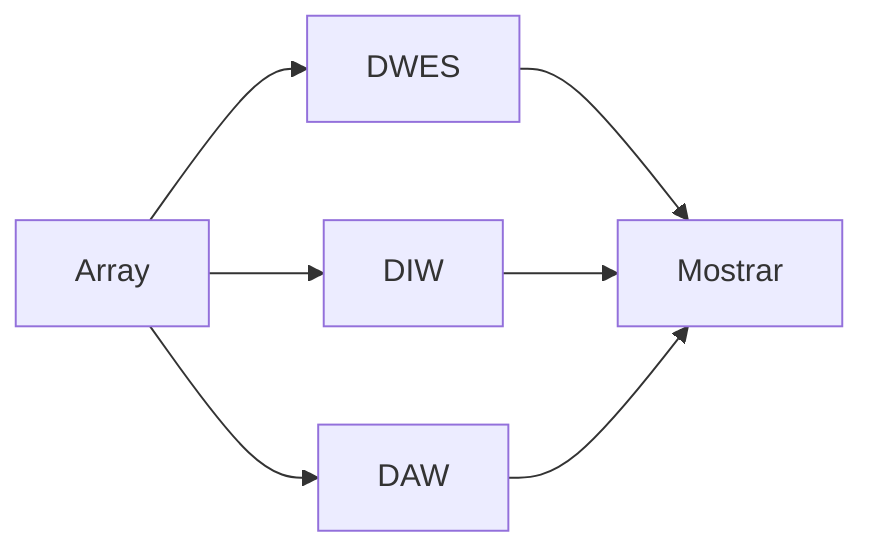

# Estructuras de control

## Introducción

Hasta ahora hemos aprendido a almacenar información utilizando variables y a mostrar datos mediante la instrucción `echo`.

Sin embargo, los programas necesitan algo más que almacenar información. También deben ser capaces de tomar decisiones y ejecutar acciones repetitivas.

Las estructuras de control permiten modificar el flujo de ejecución de un programa en función de determinadas condiciones.

En esta sección aprenderás a:

- Utilizar variables booleanas.
- Tomar decisiones mediante la estructura `if`.
- Simplificar condiciones utilizando el operador ternario.
- Recorrer colecciones de datos mediante `foreach`.

---

## Expresiones booleanas

Una expresión booleana es una operación cuyo resultado solo puede ser uno de estos dos valores:

```text
true
false
```

Por ejemplo:

```php
<?php

$edad = 20;

$resultado = $edad >= 18;

var_dump($resultado);

?>
```

Resultado:

```text
bool(true)
```

---

## Variables booleanas

Una variable booleana almacena un valor lógico.

```php
<?php

$matriculado = true;
$aprobado = false;

?>
```

Estas variables suelen utilizarse para controlar el flujo de ejecución de los programas.

```php
<?php

$matriculado = true;

if ($matriculado) {
    echo "Alumno matriculado";
}

?>
```

---

## La estructura de control if

La estructura `if` permite ejecutar un bloque de código únicamente cuando se cumple una condición.

### Sintaxis

```php
if (condicion) {
    // instrucciones
}
```

### Ejemplo

```php
<?php

$edad = 20;

if ($edad >= 18) {
    echo "Mayor de edad";
}

?>
```

---

## Cómo funciona un if



---

## La estructura if...else

```php
<?php

$edad = 16;

if ($edad >= 18) {
    echo "Mayor de edad";
} else {
    echo "Menor de edad";
}

?>
```

Resultado:

```text
Menor de edad
```

---

## Operadores de comparación

| Operador | Significado |
|-----------|-------------|
| `==` | Igual que |
| `!=` | Distinto de |
| `>` | Mayor que |
| `<` | Menor que |
| `>=` | Mayor o igual que |
| `<=` | Menor o igual que |

---

## Operador ternario

### Sintaxis

```php
condicion ? valor_si_verdadero : valor_si_falso
```

### Ejemplo

```php
<?php

$edad = 20;

echo ($edad >= 18)
    ? "Mayor de edad"
    : "Menor de edad";

?>
```

!!! tip "Consejo"

    Si una condición ocupa varias líneas o contiene mucha lógica, utiliza `if` y `else`.

---

## Recorrido de colecciones de datos

Utilizaremos un array y una estructura que recorra todos sus elementos automáticamente.

---

## La estructura foreach

### Sintaxis

```php
foreach ($array as $elemento) {

}
```

### Ejemplo básico

```php
<?php

$modulos = [
    "DWES",
    "DIW",
    "DAW"
];

foreach ($modulos as $modulo) {
    echo $modulo . "<br>";
}

?>
```

---

## Cómo funciona foreach



---

## Arrays asociativos y foreach

```php
<?php

$alumno = [
    "nombre" => "Ana",
    "edad" => 20,
    "grupo" => "1º DAW"
];

foreach ($alumno as $clave => $valor) {
    echo $clave . ": " . $valor . "<br>";
}

?>
```

---

## Errores frecuentes

### Utilizar = en lugar de ==

```php
if ($edad == 18)
```

### Olvidar las llaves

```php
if ($edad >= 18) {
    echo "Mayor";
}
```

### Aplicar foreach a una variable que no es un array

```php
$alumnos = ["Ana", "Luis"];
```

---

## Actividades de aprendizaje

### Actividad 1

Crea una variable llamada `$edad` y utiliza una estructura `if` para mostrar:

```text
Mayor de edad
```

### Actividad 2

Modifica el ejercicio anterior utilizando `if...else`.

### Actividad 3

Utiliza el operador ternario para mostrar:

```text
Aprobado
```

o

```text
Suspenso
```

según una variable llamada `$nota`.

### Actividad 4

Declara un array con los nombres de cinco módulos del ciclo y recórrelo mediante `foreach`.

### Actividad 5

Declara un array asociativo con la información de un alumno y muéstrala utilizando `foreach`.

### Actividad 6

Combina `if` y `foreach` para mostrar únicamente las notas iguales o superiores a 5.

---

## Actividad de reflexión

1. ¿Qué estructura utilizarías para tomar decisiones?
2. ¿Qué estructura utilizarías para recorrer todos los elementos de un array?
3. ¿Qué ventajas aporta el operador ternario frente a un `if` sencillo?

---

## Resumen

En esta sección has aprendido a:

- Trabajar con expresiones y variables booleanas.
- Utilizar la estructura `if`.
- Tomar decisiones mediante `if...else`.
- Simplificar condiciones mediante el operador ternario.
- Recorrer arrays utilizando `foreach`.
- Procesar arrays asociativos.

En el siguiente apartado estudiaremos las funciones.
