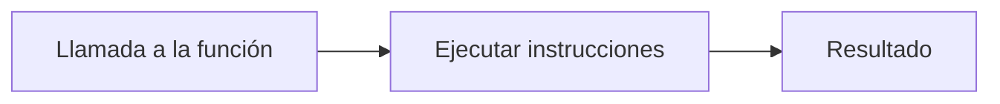
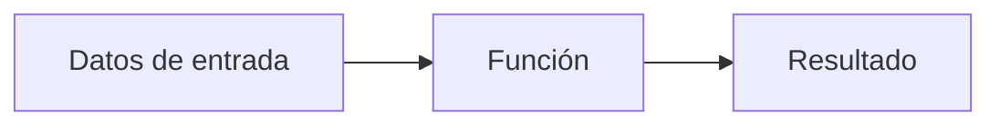
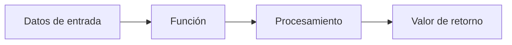

# Funciones

## Introducción

A medida que los programas crecen, es habitual encontrarnos con fragmentos de código que se repiten varias veces.

Por ejemplo:

```php
echo "Bienvenido";
echo "<br>";

echo "Bienvenido";
echo "<br>";

echo "Bienvenido";
```

Aunque este código funciona, no resulta una solución adecuada. Si más adelante quisiéramos cambiar el mensaje, tendríamos que modificarlo en todos los lugares donde aparece.

Las funciones permiten agrupar instrucciones bajo un nombre para reutilizarlas tantas veces como sea necesario.

---

## ¿Qué es una función?

Una función es un bloque de código que realiza una tarea concreta.

Una vez definida, puede ejecutarse tantas veces como sea necesario.



---

## Crear una función

```php
function nombreFuncion()
{
    // instrucciones
}
```

Ejemplo:

```php
function saludar()
{
    echo "Hola";
}
```

---

## Llamar a una función

```php
function saludar()
{
    echo "Hola";
}

saludar();
```

Resultado:

```text
Hola
```

---

## Tipo void

```php
function saludar(): void
{
    echo "Hola";
}
```

El tipo `void` significa que la función no devuelve ningún resultado mediante `return`.

---

## Ventajas de utilizar funciones

- Reutilizar código.
- Reducir errores.
- Mejorar la legibilidad.
- Facilitar el mantenimiento.
- Dividir problemas complejos en tareas más sencillas.

---

## Parámetros de una función

```php
function saludar($nombre)
{
    echo "Hola " . $nombre;
}

saludar("Ana");
```

Resultado:

```text
Hola Ana
```

---

## Varios parámetros

```php
function presentar($nombre, $edad)
{
    echo "Me llamo " . $nombre;
    echo " y tengo " . $edad . " años.";
}

presentar("Ana", 20);
```

---

## Cómo funcionan los parámetros



---

## Declaraciones de tipo en parámetros

```php
function mostrarEdad(int $edad): void
{
    echo $edad;
}
```

---

## Tipos habituales en funciones

| Tipo | Ejemplo |
|--------|----------|
| string | "Ana" |
| int | 20 |
| float | 8.5 |
| bool | true |
| array | ["DWES", "DIW"] |
| void | Sin valor de retorno |

---

## Valores por defecto

```php
function saludar(string $nombre = "Alumno"): void
{
    echo "Hola " . $nombre;
}

saludar();
saludar("Ana");
```

---

## Mostrar no es devolver

### Mostrar información

```php
function mostrarMensaje(): void
{
    echo "Hola";
}
```

### Devolver información

```php
function obtenerMensaje(): string
{
    return "Hola";
}
```

---

## Retorno de funciones

```php
function sumar(int $a, int $b): int
{
    return $a + $b;
}

$resultado = sumar(3, 5);

echo $resultado;
```

Resultado:

```text
8
```

---

## Cómo funciona return



---

## Declaración del tipo de retorno

```php
function obtenerNombre(): string
{
    return "Ana";
}
```

```php
function sumar(int $a, int $b): int
{
    return $a + $b;
}
```

---

## Ejemplo práctico completo

Supongamos que queremos calcular la nota media de un alumno.

```php
function calcularMedia(
    float $nota1,
    float $nota2
): float
{
    return ($nota1 + $nota2) / 2;
}

$media = calcularMedia(8.5, 7.5);

echo "Media: " . $media;
```

Resultado:

```text
Media: 8.0
```

También podríamos formatear el resultado utilizando `printf()`:

```php
printf(
    "Media: %.1f",
    calcularMedia(8.5, 7.5)
);
```

Resultado:

```text
Media: 8.0
```

!!! tip "Buenas prácticas"

    Cuando trabajes con notas o cantidades decimales, resulta conveniente controlar el número de decimales mostrados al usuario.

---

## Buenas prácticas

### Utiliza nombres descriptivos

✅ Correcto

```php
calcularMedia()
obtenerAlumno()
mostrarDatos()
```

❌ Poco descriptivo

```php
f1()
dato()
proceso()
```

### Declara los tipos

```php
function sumar(int $a, int $b): int
{
    return $a + $b;
}
```

### Diseña funciones pequeñas

Cada función debería resolver una única tarea.

---

## Errores frecuentes

### Olvidar los paréntesis

```php
saludar();
```

### Olvidar return

```php
function sumar($a, $b)
{
    return $a + $b;
}
```

### Pasar un número incorrecto de parámetros

```php
presentar("Ana");
```

---

## Actividades de aprendizaje

### Actividad 1
Crea una función llamada `saludar()` que muestre tu nombre.

### Actividad 2
Crea una función llamada `mostrarCiudad()` que reciba una ciudad como parámetro.

### Actividad 3
Crea una función llamada `sumar()` que reciba dos números y muestre el resultado.

### Actividad 4
Crea una función con un parámetro cuyo valor por defecto sea `"Alumno"`.

### Actividad 5
Crea una función que devuelva el área de un rectángulo.

### Actividad 6
Añade declaraciones de tipo utilizando PHP 8.

### Actividad 7
Crea una función llamada `esAprobado()` que reciba una nota y devuelva `true` o `false`.

### Actividad 8
Crea una función que reciba un array de notas y devuelva la nota media.

### Actividad 9
Desarrolla una ficha de alumno utilizando funciones.

La aplicación deberá:

- Obtener el nombre del alumno.
- Obtener la edad.
- Calcular una nota media.
- Indicar si el alumno está aprobado.

Utiliza parámetros, valores de retorno y declaraciones de tipo.

---

## Actividad de reflexión

1. ¿Cuál será más fácil de mantener: un programa con código repetido o uno que utilice funciones?
2. ¿Qué ventajas aporta la reutilización de código?
3. ¿Por qué es recomendable declarar tipos en PHP 8?

---

## Resumen

En esta sección has aprendido a:

- Crear funciones.
- Ejecutar funciones.
- Utilizar parámetros.
- Asignar valores por defecto.
- Declarar tipos en PHP 8.
- Utilizar el tipo `void`.
- Devolver resultados mediante `return`.
- Especificar tipos de retorno.
- Aplicar buenas prácticas de programación.

Ya dispones de los conocimientos fundamentales necesarios para desarrollar programas PHP estructurados, reutilizables y fáciles de mantener.
