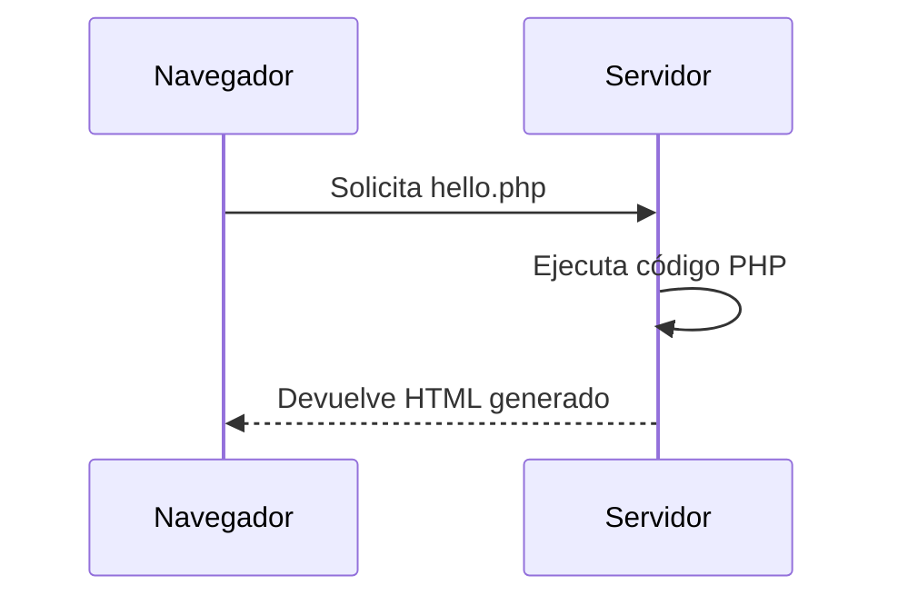

# Primeros pasos con PHP

## Introducción

Ha llegado el momento de escribir nuestro primer programa en PHP.

En esta sección aprenderás cómo se escribe código PHP, cómo se integra en una página web y cómo ejecutar tus primeros ejemplos utilizando el entorno de desarrollo preparado en la unidad anterior.

No te preocupes si nunca has programado antes. Comenzaremos con ejemplos muy sencillos e iremos incorporando nuevos conceptos de forma progresiva.

---

## Cómo programar en PHP

Los programas PHP se almacenan en archivos con extensión `.php`.

Por ejemplo:

```text
hola.php
```

Cuando un usuario solicita uno de estos archivos desde el navegador, el servidor interpreta el código PHP y genera una respuesta que será enviada al cliente.

---

## Las etiquetas de PHP

Todo el código PHP debe escribirse entre las etiquetas de apertura y cierre del lenguaje:

```php
<?php

// Código PHP

?>
```

La etiqueta de apertura indica al servidor que debe comenzar a interpretar código PHP.

La etiqueta de cierre indica dónde finaliza dicho código.

!!! note "Nota"

    En muchos proyectos modernos se omite la etiqueta de cierre cuando el archivo contiene únicamente código PHP.

---

## Nuestra primera instrucción

La instrucción más sencilla en PHP es `echo`.

Permite mostrar información en la página web.

```php
<?php

echo "Hola mundo";

?>
```

Al ejecutar este programa el navegador mostrará:

```text
Hola mundo
```

!!! tip "Recuerda"

    Toda instrucción PHP finaliza con punto y coma (`;`).

---

## Primer programa: Hello World

Crea un archivo llamado:

```text
hello.php
```

e introduce el siguiente código:

```php
<?php

echo "Hello World";

?>
```

Guarda el archivo dentro de tu servidor local y accede a él desde el navegador.

Si todo está correctamente configurado deberías visualizar:

```text
Hello World
```

---

## ¿Qué sucede cuando ejecutamos un programa PHP?

Cuando accedemos a una página PHP se produce el siguiente proceso:



Observa que el navegador nunca recibe el código PHP.

Únicamente recibe el resultado generado tras su ejecución.

---

## Mostrar diferentes mensajes

La instrucción `echo` puede utilizarse tantas veces como sea necesario.

```php
<?php

echo "Bienvenido a DWES";
echo "<br>";
echo "Estamos aprendiendo PHP";

?>
```

---

## PHP y HTML

Una de las ventajas de PHP es que puede integrarse directamente dentro de documentos HTML.

```php
<!DOCTYPE html>
<html lang="es">
<head>
    <meta charset="UTF-8">
    <title>Mi primera página PHP</title>
</head>
<body>

    <h1>Ejemplo de PHP</h1>

    <?php
        echo "Hola desde PHP";
    ?>

</body>
</html>
```

---

## Comentarios en PHP

Los comentarios permiten añadir información al código sin que sea ejecutada.

### Comentario de una línea

```php
// Este es un comentario
```

### Comentario de varias líneas

```php
/*
Este comentario puede
ocupar varias líneas.
*/
```

---

## Errores frecuentes

### Olvidar el punto y coma

```php
echo "Hola mundo";
```

### Guardar el archivo con otra extensión

Correcto:

```text
hola.php
```

---

## Actividades de aprendizaje

### Actividad 1

Crea un archivo llamado `saludo.php` que muestre el mensaje:

```text
Bienvenido al módulo de DWES
```

### Actividad 2

Modifica el programa anterior para mostrar dos mensajes diferentes utilizando dos instrucciones `echo`.

### Actividad 3

Crea una página HTML sencilla e inserta un bloque PHP que muestre tu nombre.

### Actividad 4

Añade comentarios al código del ejercicio anterior explicando qué realiza cada parte del programa.

---

## Actividad de reflexión

Accede desde el navegador al código fuente de una página PHP creada por ti.

¿Puedes ver el código PHP que has escrito?

Reflexiona sobre la respuesta y relaciónala con el concepto de ejecución en servidor estudiado en la introducción.

---

## Resumen

En esta sección has aprendido a:

- Crear archivos PHP.
- Utilizar las etiquetas del lenguaje.
- Mostrar información mediante `echo`.
- Ejecutar tu primer programa.
- Combinar PHP y HTML.
- Añadir comentarios al código.

En el siguiente apartado comenzaremos a trabajar con variables y tipos de datos.
