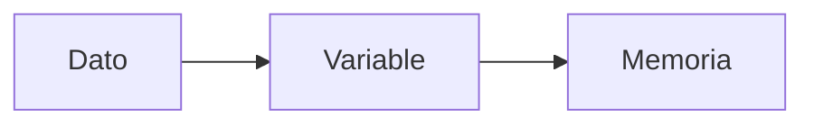

# Variables y tipos de datos

## Introducción

Hasta ahora hemos mostrado mensajes en pantalla utilizando la instrucción `echo`. Sin embargo, las aplicaciones web necesitan almacenar y manipular información.

Para ello utilizamos variables.

Las variables permiten guardar datos en memoria para poder utilizarlos posteriormente dentro de nuestros programas.

En esta sección aprenderás a declarar variables, trabajar con distintos tipos de datos y utilizar las declaraciones de tipo disponibles en PHP 8.

---

## ¿Qué es una variable?

Una variable es un espacio de memoria identificado mediante un nombre que permite almacenar información.

Podemos imaginar una variable como una caja etiquetada donde guardamos un dato para recuperarlo posteriormente.



Por ejemplo:

```php
<?php

$nombre = "Ana";
```

En este caso, la variable `$nombre` almacena el texto `"Ana"`.

---

## Declaración de variables

En PHP todas las variables comienzan por el símbolo `$`.

```php
<?php

$nombre = "Ana";
$edad = 20;
```

Una vez declaradas, pueden utilizarse tantas veces como sea necesario.

```php
<?php

$nombre = "Ana";

echo $nombre;
```

Resultado:

```text
Ana
```

!!! warning "Importante"

    Todas las variables deben comenzar por el símbolo `$`.

---

## Reglas para nombrar variables

✅ Correcto

```php
$nombre
$edad
$notaMedia
$direccionAlumno
```

❌ Incorrecto

```php
$1nombre
$nota-media
$mi variable
```

Se recomienda utilizar nombres descriptivos que indiquen claramente la información almacenada.

---

## Tipos de datos en PHP

| Tipo | Ejemplo |
|--------|---------|
| string | "Hola" |
| int | 25 |
| float | 8.75 |
| bool | true o false |

---

## Cadenas de texto (string)

```php
$nombre = "Antonio";

echo $nombre;
```

---

## Números enteros (int)

```php
$edad = 20;

echo $edad;
```

---

## Números decimales (float)

```php
$nota = 8.5;

echo $nota;
```

---

## Valores booleanos (bool)

Los booleanos únicamente pueden tomar dos valores:

- `true`
- `false`

```php
$matriculado = true;
```

Este tipo resulta especialmente útil cuando trabajamos con estructuras de control.

---

## Mostrar variables en pantalla

```php
<?php

$nombre = "Ana";
$edad = 20;

echo $nombre;
echo "<br>";
echo $edad;
```

---

## Concatenación de cadenas

La concatenación permite unir textos y valores. En PHP se utiliza el operador `.`.

```php
$nombre = "Ana";

echo "Hola " . $nombre;
```

Resultado:

```text
Hola Ana
```

```php
$nombre = "Ana";
$edad = 20;

echo "Me llamo " . $nombre . " y tengo " . $edad . " años.";
```

---

## Ejemplo práctico

```php
$nombre = "Laura";
$edad = 22;
$notaMedia = 8.75;
$matriculada = true;

echo "Nombre: " . $nombre . "<br>";
echo "Edad: " . $edad . "<br>";
echo "Nota media: " . $notaMedia;
```

---

## Conversión automática de tipos

```php
$numero = "25";

$resultado = $numero + 5;

echo $resultado;
```

Resultado:

```text
30
```

!!! note "Nota"

    Aunque PHP permite conversiones automáticas, es recomendable utilizar siempre el tipo de dato adecuado.

---

## Declaraciones de tipo en PHP 8

Una de las mejoras más importantes de PHP moderno es la posibilidad de declarar el tipo de los parámetros.

```php
function mostrarEdad(int $edad)
{
    echo $edad;
}

mostrarEdad(20);
```

Esto ayuda a detectar errores y hace que el código sea más fácil de mantener.

---

## Tipos de retorno

También es posible indicar el tipo de dato que devuelve una función.

```php
function obtenerNombre(): string
{
    return "Ana";
}
```

```php
function sumar(int $a, int $b): int
{
    return $a + $b;
}
```

!!! tip "Buenas prácticas"

    Siempre que sea posible, declara los tipos de los parámetros y del valor de retorno de las funciones.

---

## Introducción a los arrays

Un array permite almacenar varios valores dentro de una misma variable.

```php
$modulos = [
    "DWES",
    "DIW",
    "DAW"
];
```

En el siguiente tema utilizaremos arrays junto con la estructura `foreach`.

---

## Errores frecuentes

### Olvidar el símbolo $

Incorrecto:

```php
nombre = "Ana";
```

Correcto:

```php
$nombre = "Ana";
```

### Utilizar espacios en el nombre

Incorrecto:

```php
$nombre alumno = "Ana";
```

Correcto:

```php
$nombreAlumno = "Ana";
```

### Confundir mayúsculas y minúsculas

PHP distingue entre:

```php
$nombre
$Nombre
```

Son variables diferentes.

---

## Actividades de aprendizaje

### Actividad 1

Declara variables que almacenen:

- Tu nombre.
- Tu edad.
- Tu ciudad.

Muestra la información utilizando `echo`.

### Actividad 2

Crea una variable llamada `$precio` con el valor `19.95` y muéstrala en pantalla.

### Actividad 3

Declara una variable booleana llamada `$activo`.

Prueba a asignarle los valores `true` y `false`.

### Actividad 4

Muestra una frase similar a:

```text
Me llamo Ana y tengo 20 años.
```

utilizando variables y concatenación.

### Actividad 5

Declara un array que contenga los nombres de tres módulos del ciclo formativo.

---

## Actividad de reflexión

Observa la siguiente información:

```text
Nombre: Ana
Edad: 20
Nota media: 8.5
Matriculada: Sí
```

¿Qué tipo de dato utilizarías para almacenar cada uno de estos valores?

Justifica tu respuesta.

---

## Resumen

En esta sección has aprendido a:

- Declarar variables.
- Utilizar distintos tipos de datos.
- Mostrar información almacenada en variables.
- Concatenar cadenas de texto.
- Utilizar declaraciones de tipo en PHP 8.
- Definir tipos de retorno en funciones.
- Crear arrays sencillos.

En el siguiente apartado estudiaremos las estructuras de control.
